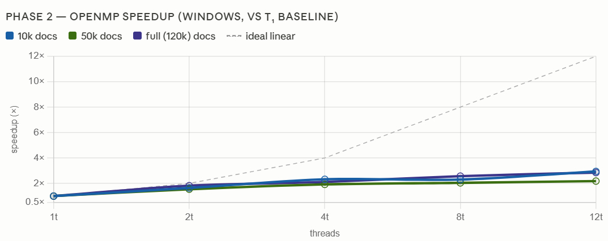
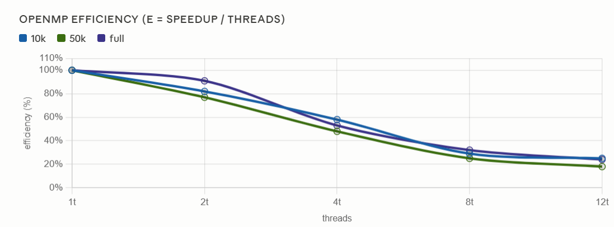
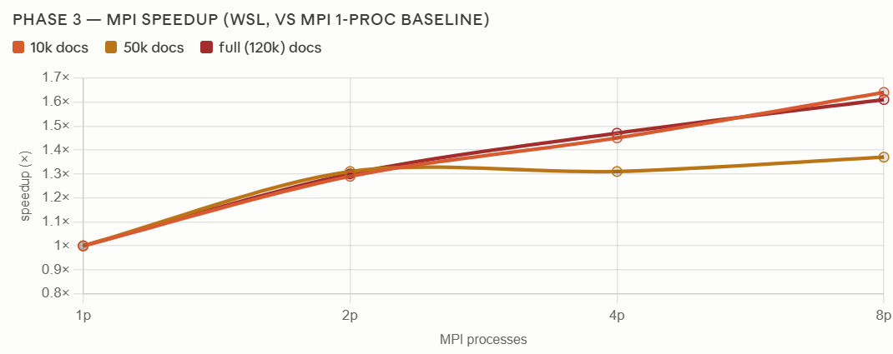
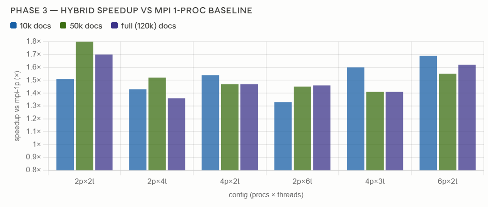
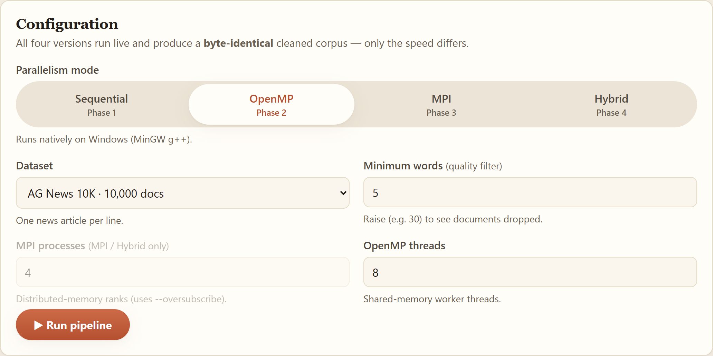
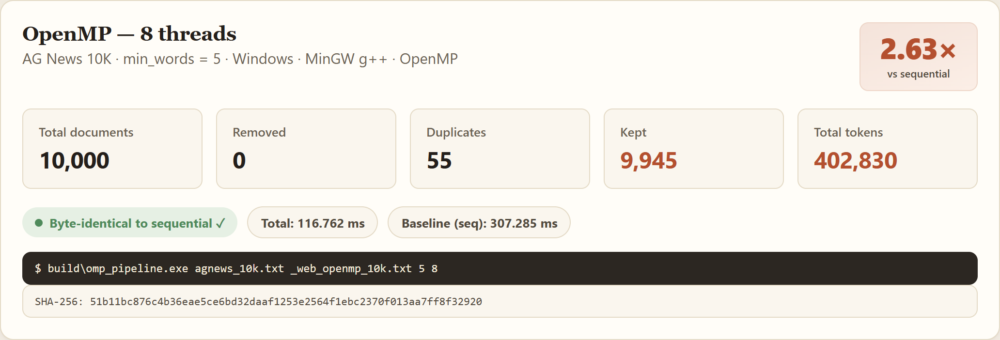
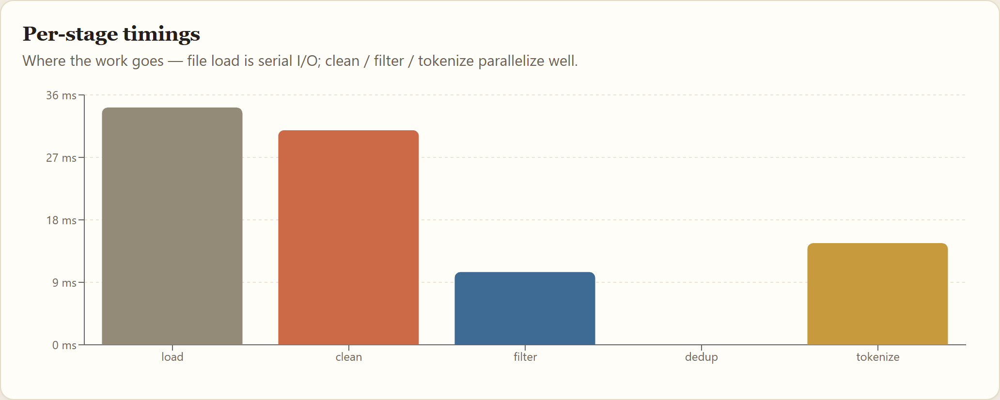
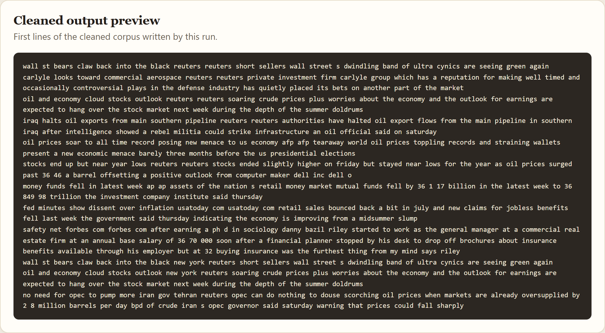

# Parallel Data Preprocessing Pipeline for LLM Fine-Tuning
### Using Hybrid OpenMP + MPI in C++ — Complete Project Report

**Author:** Huzaifa Arshad &nbsp;&nbsp;|&nbsp;&nbsp; **Registration No:** 2023-CS-86

**Course:** Parallel & Distributed Computing (PDC)<br>**Pipeline:** Sequential → OpenMP → MPI → Hybrid (MPI + OpenMP) → DistilGPT-2 fine-tuning<br>**Dataset:** AG News (~120,000 real news articles, Hugging Face)<br>**Status:** ✅ All three phases complete & verified byte-identical · DistilGPT-2 fine-tuned (val. perplexity ≈ 95.3)<br>**Report date:** 2026-06-22

> **Interactive graphs / working notes:** the performance graphs in this report were
> produced with assistance from Claude — full chat & chart-building session here:
> <https://claude.ai/share/d995b170-190e-458d-8682-540bee2fe0f7>

---

## Table of Contents

1. [Introduction & Problem Statement](#1-introduction--problem-statement)
2. [The Preprocessing Pipeline (4 Stages)](#2-the-preprocessing-pipeline-4-stages)
3. [System Architecture & Design Philosophy](#3-system-architecture--design-philosophy)
4. [Dataset — AG News](#4-dataset--ag-news)
5. [Phase 1 — Sequential Baseline](#5-phase-1--sequential-baseline)
6. [Phase 2 — OpenMP (Shared Memory)](#6-phase-2--openmp-shared-memory)
7. [Phase 3 — MPI & Hybrid (Distributed Memory)](#7-phase-3--mpi--hybrid-distributed-memory)
8. [Performance Results & Analysis](#8-performance-results--analysis)
9. [LLM Fine-Tuning (DistilGPT-2)](#9-llm-fine-tuning-distilgpt-2)
10. [Interactive Web Interface — Foundry](#10-interactive-web-interface--foundry)
11. [Correctness Verification](#11-correctness-verification)
12. [Build & Run Guide](#12-build--run-guide)
13. [Conclusion](#13-conclusion)
14. [Appendix A — Toolchain Notes](#appendix-a--toolchain-notes)
15. [References](#references)

---

## 1. Introduction & Problem Statement

Large Language Model (LLM) fine-tuning requires large volumes of **clean** text.
Raw corpora are messy: mixed case, punctuation and symbols, near-empty
fragments, and many exact duplicates. Training on dirty or duplicated data wastes
compute and degrades the model. A **preprocessing pipeline** fixes this — and
because corpora are huge, that pipeline is a natural target for parallelism.

This project builds such a pipeline in C++ and implements it in **four
progressively parallel versions**, each of which must produce a **byte-identical**
result:

| Version | Parallelism model | Scope |
|---------|-------------------|-------|
| **Sequential** | none (reference) | correctness baseline |
| **OpenMP** | shared-memory threads | one multi-core machine |
| **MPI** | distributed-memory processes | many machines (here: simulated on one) |
| **Hybrid** | MPI across + OpenMP within | one process per node × cores per node |

The project is delivered to the instructor in **three phases**:

| Phase | Goal | Status |
|-------|------|--------|
| **Phase 1** | Sequential baseline + datasets + 4 stages + stats + timing | ✅ DONE |
| **Phase 2** | OpenMP, benchmarks, speedup/efficiency analysis | ✅ DONE |
| **Phase 3** | MPI master–worker + Hybrid MPI+OpenMP, benchmarks | ✅ DONE |
| | DistilGPT-2 Colab fine-tuning on the cleaned corpus | ✅ DONE |

The guiding principle of the whole project: **"Make it work, then make it
fast" — without ever changing what "correct" means.** The sequential version
defines the correct output; every parallel version must reproduce it exactly,
proving that the speedup came for free.

---

## 2. The Preprocessing Pipeline (4 Stages)

The pipeline is a linear flow of four independent, per-document stages:

```
 raw .txt ─▶ [1 Clean] ─▶ [2 Quality filter] ─▶ [3 Deduplicate] ─▶ [4 Tokenize/count] ─▶ clean .txt + stats
```

| Stage | What it does | Module |
|-------|--------------|--------|
| **1. Text Cleaning** | lowercase, remove special characters, normalize whitespace | `src/common/1text_cleaning.*` |
| **2. Quality Filtering** | drop documents below a minimum word count | `src/common/2quality_filter.*` |
| **3. Deduplication** | fingerprint each doc (FNV-1a 64-bit hash), drop duplicates | `src/common/3deduplication.*` |
| **4. Tokenization** | split into word tokens, count total tokens | `src/common/4tokenizer.*` |

### Algorithm details

- **Stage 1 — Cleaning.** One pass over the characters: alphanumerics are
  lowercased and kept; every run of non-alphanumeric characters collapses to a
  single space; leading/trailing spaces are trimmed. Doing all three operations
  in one pass is cache-friendly and O(n) in document length.
- **Stage 2 — Quality filter.** Count words by detecting whitespace→word
  transitions (no allocation), and drop documents with fewer than `min_words`
  words (default 5).
- **Stage 3 — Deduplication.** Compute a 64-bit **FNV-1a** [2] fingerprint of the
  cleaned text and keep only the **first** document per fingerprint, using an
  `unordered_set<uint64_t>`. FNV-1a is chosen over `std::hash` because it is
  **stable** across compilers and machines — essential for MPI, where workers on
  different nodes must agree on fingerprints.
- **Stage 4 — Tokenization.** Whitespace tokenization; sum token counts over the
  surviving documents (a reduction).

A document is written to the output **only if it survives stages 2 and 3**. The
order of stages is fixed: we clean *before* filtering/dedup so quality and
duplicate checks operate on normalized text (otherwise `"Hello!"` and `"hello"`
would not deduplicate).

### Worked example — one real AG News article

```
Raw:    Wall St. Bears Claw Back Into the Black (Reuters) Reuters - Short-sellers, Wall
        Street's dwindling band of ultra-cynics, are seeing green again.
Clean:  wall st bears claw back into the black reuters reuters short sellers wall
        street s dwindling band of ultra cynics are seeing green again
```

It has ~24 words (passes the 5-word filter), gets a fingerprint, is kept if
unique, and contributes its tokens to the total.

---

## 3. System Architecture & Design Philosophy

The single most important design decision is that **all stage logic lives in
`src/common/` as pure, per-document functions**, separate from the orchestration
loop. Each version of the pipeline changes **only how it loops over documents**,
never the stage logic itself.

```
src/
├── common/                  # SHARED stage logic — reused by EVERY version
│   ├── document.hpp           #   Document{ id, text }
│   ├── timer.hpp              #   <chrono> wall-clock timer
│   ├── statistics.hpp         #   PipelineStats counters + per-stage timings
│   ├── 1text_cleaning.*       #   Stage 1
│   ├── 2quality_filter.*      #   Stage 2
│   ├── 3deduplication.*       #   Stage 3
│   ├── 4tokenizer.*           #   Stage 4
│   ├── io_utils.*             #   file read/write + CSV stats appender
│   └── mpi_pipeline.hpp       #   Phase 3 shared MPI driver (mpi + hybrid)
├── sequential/main_sequential.cpp   # Phase 1
├── openmp/main_openmp.cpp           # Phase 2
├── mpi/main_mpi.cpp                 # Phase 3 (pure MPI)
└── hybrid/main_hybrid.cpp           # Phase 3 (MPI + OpenMP)
```

**Why this matters — the correctness contract.** Because the stage logic never
changes, a parallel run can only differ from the sequential run in *speed*, never
in *output*. The only order-dependent decisions in the entire pipeline are:

1. "Is this the first time I have seen this fingerprint?" (deduplication), and
2. the order documents are written.

Both are performed **serially, in original-id order**, in every version. This is
what guarantees byte-identical output — by *construction*, not by luck.

This separation also maps each stage cleanly onto a parallel construct:

| Stage | Pure / independent? | Parallel construct |
|-------|:-------------------:|--------------------|
| 1 Clean | ✅ each doc independent | `parallel for` |
| 2 Filter | ✅ decision per doc; serial compaction | `parallel for` + serial compact |
| 3 Dedup | hash ✅ pure / decision ❌ ordered | `parallel for` (hash) + serial walk |
| 4 Tokenize | ✅ per-doc count | `parallel for reduction(+:)` |

---

## 4. Dataset — AG News

We use a single, **real** dataset: **AG News** [1] from the Hugging Face Hub
(repository `fancyzhx/ag_news`) — ~120,000 real news articles across 4 categories
(World, Sports, Business, Sci/Tech). We use the article text and ignore the
labels.

`scripts/download_agnews.py` downloads it once and writes one article per line in
four sizes, where each smaller file is an **exact prefix** of the larger ones —
so scaling can be benchmarked on *identical, real* text:

| File | Documents |
|------|----------:|
| `agnews_1k.txt` | 1,000 |
| `agnews_10k.txt` | 10,000 |
| `agnews_50k.txt` | 50,000 |
| `agnews_full.txt` | ~120,000 |

> **Why a real dataset (not synthetic)?** A real corpus is far more convincing
> for the LLM fine-tuning goal, and AG News still exercises every stage. Note
> that AG News articles are full sentences, so almost nothing falls below the
> 5-word quality bar (`Removed = 0`) — an honest result for clean, curated data.
> Raising `min_words` (e.g. to 30) makes the quality filter visibly drop
> documents. Source: <https://huggingface.co/datasets/fancyzhx/ag_news>

---

## 5. Phase 1 — Sequential Baseline

Phase 1 establishes the **correct** reference implementation
(`src/sequential/main_sequential.cpp`). It is the conductor: it parses arguments,
loads the file into a `vector<Document>`, runs the four stages in turn (each timed
with `<chrono>`), updates the `PipelineStats` counters, writes the cleaned output,
and prints the report.

Implementation notes worth highlighting for the viva:
- Stages 2 and 3 build **new** survivor vectors rather than erasing from the
  middle of a vector (erasing is O(n) per element → O(n²); copying survivors is a
  single O(n) pass).
- Time is measured as **wall-clock** (`high_resolution_clock`) because that is
  what the user waits for and the only metric that improves with parallelism
  (CPU time would *increase* with more threads).

### Correctness counters (the contract — identical in all later phases)

| Dataset | Total | Removed | Duplicates | Kept | Total tokens |
|---------|------:|--------:|-----------:|-----:|-------------:|
| 1K   | 1,000   | 0 | 2   | 998     | 41,588    |
| 10K  | 10,000  | 0 | 55  | 9,945   | 402,830   |
| 50K  | 50,000  | 0 | 112 | 49,888  | 1,993,026 |
| Full | 120,000 | 0 | 218 | 119,782 | 4,750,500 |

The on-screen report self-checks: `Kept = Total − Removed − Duplicates` must
balance exactly, or a stage is broken.

### Sample output

```
==================== SEQUENTIAL ====================
Total documents      : 10000
Removed (low quality): 0
Duplicates removed   : 55
Kept documents       : 9945
Total tokens         : 402830
----------------------------------------------------
Stage timings (ms):
  load      : 41.965
  clean     : 50.935
  filter    : 26.209
  dedup     : 5.488
  tokenize  : 25.153
  TOTAL     : 158.161
====================================================
Cleaned dataset written to: results\clean_10k.txt
```

**Observation that motivates Phase 2:** the dominant costs (cleaning, filtering,
tokenization) are all per-document and embarrassingly parallel — roughly 70–80%
of the runtime — so by Amdahl's law [5] a strong speedup is expected once threads are
added.

---

## 6. Phase 2 — OpenMP (Shared Memory)

Phase 2 (`src/openmp/main_openmp.cpp`) keeps every `src/common/` stage function
**unchanged** and parallelizes only the driving loops with OpenMP [3]. The central
idea: **parallelize the pure, per-document work; keep the order-dependent
decisions serial.**

| Stage | Parallel part | Serial part | OpenMP construct |
|-------|---------------|-------------|------------------|
| 1 Clean | `clean_text` on each doc | — | `parallel for` |
| 2 Filter | compute keep/drop per doc | compact survivors in order | `parallel for` + serial compaction |
| 3 Dedup | FNV-1a hash of each doc | "first occurrence wins" decision | `parallel for` + serial set walk |
| 4 Tokenize | count tokens per doc | — | `parallel for reduction(+:)` |

### Shared vs private variables (why there are no data races)

- **Read-only shared:** the document vectors, `min_words`.
- **Written but disjoint** (each index touched by exactly one thread → safe):
  `docs[i].text`, `keep[i]`, `fps[i]`.
- **Reduction:** `token_sum` (private partial per thread, merged by OpenMP).
- **Private by definition:** the loop counter.
- **Serial-only state:** the dedup `seen` set and all `push_back`s run *outside*
  any parallel region, so they need no locking.

`schedule(static)` is used because per-document cost is roughly uniform, giving an
even, low-overhead split. A signed `long long` loop counter is used for
`parallel for` portability.

**Result:** up to **2.94×** speedup (10K, 12 threads); **2.85×** on the full set.
Full numbers, graphs and Amdahl's-law analysis are in
[§8 Performance Results](#8-performance-results--analysis).

---

## 7. Phase 3 — MPI & Hybrid (Distributed Memory)

Phase 3 distributes the pipeline across **processes** with MPI [4], then layers
OpenMP **inside** each process (hybrid). Both new builds reproduce the sequential
output byte-for-byte.

### 7.1 One source of truth — MPI and Hybrid cannot diverge

The entire distributed driver lives in `src/common/mpi_pipeline.hpp` as one
function, `run_pipeline_mpi(...)`, which already contains `#pragma omp parallel
for` on its per-document loops:

| Binary | Source | Compiled with | Effect of the pragmas |
|--------|--------|---------------|-----------------------|
| `mpi_pipeline` | `src/mpi/main_mpi.cpp` | `mpicxx` (no `-fopenmp`) | **ignored** → pure MPI, serial within each process |
| `hybrid_pipeline` | `src/hybrid/main_hybrid.cpp` | `mpicxx -fopenmp` | **active** → MPI + OpenMP threads within each process |

Each `main_*.cpp` is a tiny wrapper calling `run_pipeline_mpi(...)`. Because the
two binaries are literally the same source, they **cannot** compute different
results.

### 7.2 Communication design (master–worker, scatter → gather)

```
            rank 0 reads agnews_full.txt   (single reader, like the sequential code)
                         │
        split into P contiguous, ORDERED blocks   (block r = docs[off_r .. off_r+cnt_r))
                         │  MPI_Scatterv  (lengths array, then packed text bytes)
        ┌───────────┬────┴──────┬───────────┐
     rank 0      rank 1      rank 2      rank 3      ← each runs the SAME common stages
     clean        clean       clean       clean        Stage 1
     filter       filter      filter      filter       Stage 2  (counts its own "removed")
     fingerprint  …           …           …            Stage 3a (FNV-1a, pure)
     tokens       …           …           …            Stage 4  (count, pure)
        └───────────┴────┬──────┴───────────┘
                         │  MPI_Gatherv (survivor {id,fp,ntok,text})
                         │  MPI_Reduce  (Σ removed, max per-stage time)
                         ▼
            rank 0: SERIAL id-ordered dedup (Stage 3b) → write output
```

- **Why byte-identical:** blocks are contiguous and ordered, so the gathered
  survivors are already in global id order (we `stable_sort` by id anyway as a
  defensive guarantee). Rank 0 then walks that ordered list keeping the first
  occurrence of each fingerprint — identical semantics to the sequential code.
- **Synchronization:** all of it is *collective and implicit* — `MPI_Bcast`,
  `MPI_Scatterv`, `MPI_Gatherv`, `MPI_Reduce` act as barriers. There are **no
  locks and no point-to-point Send/Recv**, so there is no deadlock risk.
- **Load balancing:** static block partition — each rank gets `⌊N/P⌋` docs, the
  first `N mod P` ranks get one extra. AG News articles are similar in length, so
  equal *document counts* give near-equal *work*.
- **Serializing variable-length text:** strings cannot be a fixed MPI type, so we
  send two flat buffers (an `int` length array + a packed `char` blob). Survivors
  return as a packed POD array `SurvMeta{id, fp, ntok, len}` sent as `MPI_BYTE`,
  plus a text blob, reassembled on rank 0.

### 7.3 Hybrid (MPI across, OpenMP within)

The hybrid build adds the Phase 2 strategy *inside* each MPI process: the clean /
quality-mask / fingerprint / token-count loops are `#pragma omp parallel for`;
the serial compaction and rank-0 dedup stay serial. The intended deployment is
**one MPI process per node, OpenMP across that node's cores** — MPI only at node
boundaries, every core used.

**Result:** MPI up to **~1.64×**, hybrid up to **~1.80×** on this single node —
*deliberately lower* than OpenMP. The analysis of why is the headline lesson of
Phase 3, in [§8.4](#84-why-mpi-scales-less-than-openmp-on-one-node).

---

## 8. Performance Results & Analysis

**Experimental setup.** 12-logical-core laptop. Phases 1–2 on Windows (MinGW
g++ 6.3.0, `-O2 -std=c++17 -fopenmp`); Phase 3 on WSL Ubuntu (g++ 13.3,
OpenMPI 4.1.6). Datasets: real AG News, `min_words = 5`. Each configuration is
run several times and the **minimum** total wall-clock time is reported (least
polluted by OS jitter). Reproduce with `scripts/benchmark.ps1` (OpenMP) and
`scripts/benchmark_mpi.sh` (MPI/hybrid).

### 8.1 Phase 2 — OpenMP speedup & efficiency

Total wall-clock time (ms, best of runs):

| Dataset | 1 thr | 2 | 4 | 8 | 12 |
|---------|------:|--:|--:|--:|---:|
| 10K  | 135.2  | 82.2   | 58.2  | 58.9  | 45.9  |
| 50K  | 643.1  | 416.3  | 335.6 | 315.6 | 294.4 |
| Full | 1951.6 | 1073.8 | 923.6 | 760.7 | 684.3 |

**Speedup** `S(p) = T(1)/T(p)`:

| Dataset | p=2 | p=4 | p=8 | p=12 |
|---------|----:|----:|----:|-----:|
| 10K  | 1.64× | 2.32× | 2.30× | **2.94×** |
| 50K  | 1.54× | 1.92× | 2.04× | 2.18× |
| Full | 1.82× | 2.11× | 2.57× | 2.85× |



**Efficiency** `E(p) = S(p)/p`:

| Dataset | p=2 | p=4 | p=8 | p=12 |
|---------|----:|----:|----:|-----:|
| 10K  | 82% | 58% | 29% | 25% |
| 50K  | 77% | 48% | 25% | 18% |
| Full | 91% | 53% | 32% | 24% |



Efficiency is high at low thread counts (**91%** at 2 threads on the full set)
and falls as threads are added — the classic shape of a memory-bound workload
hitting a serial floor.

### 8.2 Phase 3 — MPI speedup

Total wall-clock time (ms); baseline `T(1)` = MPI on 1 process:

| Dataset | 1p | 2p | 4p | 8p |
|---------|---:|---:|---:|---:|
| 10K  | 292.8  | 227.1  | 202.0  | 178.1  |
| 50K  | 1357.2 | 1032.5 | 1035.5 | 992.0  |
| Full | 3240.6 | 2491.9 | 2210.9 | 2007.9 |

**Speedup** `S = T(1)/T(p)`:

| Dataset | p=2 | p=4 | p=8 |
|---------|----:|----:|----:|
| 10K  | 1.29× | 1.45× | **1.64×** |
| 50K  | 1.31× | 1.31× | 1.37× |
| Full | 1.30× | 1.47× | 1.61× |



### 8.3 Phase 3 — Hybrid speedup

Hybrid speedup vs the MPI 1-process baseline, by configuration (procs × threads):

| Dataset | 2×2 | 2×4 | 4×2 | 2×6 | 4×3 | 6×2 |
|---------|----:|----:|----:|----:|----:|----:|
| 10K  | 1.51× | 1.43× | 1.54× | 1.33× | 1.60× | 1.69× |
| 50K  | **1.80×** | 1.52× | 1.47× | 1.45× | 1.41× | 1.55× |
| Full | 1.70× | 1.36× | 1.47× | 1.46× | 1.41× | 1.62× |



### 8.4 Why MPI scales *less* than OpenMP on one node

This is the core insight of the project, and an *honest, expected* result:
OpenMP reaches **2.94×** while MPI/hybrid top out near **1.6–1.8×** on the *same*
machine.

1. **Same memory-bandwidth ceiling, plus copies.** All MPI "processes" run on the
   *one* laptop, sharing *one* memory bus and *one* disk — the same bandwidth
   wall that capped OpenMP — **and** MPI additionally *copies* every document into
   send/receive buffers (over the loopback network stack) and back out. OpenMP
   threads share memory and copy nothing, so on a single node OpenMP wins.
2. **A large serial file read.** Under WSL the dataset lives on the Windows drive
   via the `/mnt/d` 9p mount, whose I/O is far slower than native. Only rank 0
   reads the file, so this serial fraction is unusually large and, by Amdahl's
   law, caps the whole program near 2× no matter how many processes are added.
3. **Communication grows with P.** Scattering tens of MB of text and gathering
   the survivors back to one rank is pure overhead that *grows* with process
   count — which is why `-np 8` can be barely better than `-np 4` on large data:
   past a point, extra communication and oversubscription cost more than the
   shrinking compute saves.

**The compute itself parallelizes superbly** — on the full set, cleaning fell
from ~800 ms (sequential) to ~77 ms across workers. The wall-clock is dominated
by serial I/O + communication, not by the stages.

**When does MPI actually win?** Across **multiple machines**: P nodes give P× the
aggregate memory bandwidth, P× the disk read throughput (each node reads its own
shard), and P× the RAM — none of which a single multi-core node can offer. This
single-node benchmark therefore shows MPI's *overhead without its payoff*; it
**understates** MPI. The **hybrid** model (one process per node × OpenMP within)
is the production design that carries this same, verified-correct code to that
multi-node world.

This is the empirical motivation for the whole progression: **Sequential →
OpenMP** wins on one node; **MPI → Hybrid** is what scales the same code to many
nodes once the data outgrows a single machine.

---

## 9. LLM Fine-Tuning (DistilGPT-2)

To close the loop from "messy data" to "a model trained on it," the cleaned
corpus is used to fine-tune a real language model. `docs/colab_finetune_distilgpt2.ipynb`
is a Google Colab notebook (GPU runtime) that uploads a cleaned file, tokenizes
it with DistilGPT-2's [6] real BPE tokenizer (via Hugging Face Transformers [7]),
fine-tunes the model, reports
perplexity, and generates sample text.

It was **run on a Colab T4 GPU** over `results/clean_10k.txt` (9,945 cleaned
documents → 3,780 packed 128-token blocks, 90/10 train/validation split):

| Metric | Value |
|--------|-------|
| Model | `distilgpt2` (82M params) |
| Epochs / steps | 1 epoch, 213 steps |
| Training time | ~44 s (≈ 77 samples/s) |
| Training loss | 5.12 → 4.78 (final avg 4.93) |
| Validation loss | 4.557 |
| **Validation perplexity** | **≈ 95.3** |

Sample generations (coherent, AG-News-style):

- *"the stock market"* → "the stock market was down 2 percent on tuesday to a
  record high of 1 million at a time of record highs according to the latest
  quarterly report …"
- *"the government announced"* → "the government announced that it will hand over
  … its more than 600 000 workforce to the agency for its investigation …"
- *"scientists have discovered"* → "scientists have discovered that there is an
  essential difference between the two worlds …"

This proves the pipeline's output is genuinely usable training data. (Re-run on
`clean_full.txt` for a stronger fit — more data, lower perplexity, longer run.)

---

## 10. Interactive Web Interface — Foundry

The project ships a professional web application, **Foundry** (`web/`), that runs
the pipeline live and visualizes the results. The frontend is **React + Vite +
Recharts**; the backend is **Node + Express**, which executes the real compiled
binaries — Sequential and OpenMP as Windows `.exe`, while **MPI and Hybrid run
inside WSL** through `mpirun`. A single server hosts both the UI and a JSON API.
The four versions are presented as **Phase 1–4** (Sequential, OpenMP, MPI, Hybrid).


### 10.1 Run Console

**Configuration.** The user picks a dataset and one of the four modes; the
relevant inputs (MPI processes, OpenMP threads) enable automatically, and
`min_words` controls the quality filter.



**Results.** After a run, the page shows the live counters, a prominent
**speedup vs the sequential baseline**, the exact command executed, the output
SHA-256, and a **byte-identical-to-sequential** correctness badge — every value
read straight from the real program.



**Per-stage timings.** A bar chart breaks the run down by stage, exposing the
serial file-load floor and the well-parallelized compute stages.



**Cleaned output.** A live preview of the cleaned corpus written by the run.



### 10.2 Benchmarks

The Benchmarks tab renders the OpenMP, MPI and Hybrid speedup/efficiency charts
**interactively**, aggregated on the server from `results/benchmark_*.csv`. These
are the same measurements already shown in [Section 8](#8-performance-results--analysis),
so the charts are not duplicated here.

### 10.3 About

A summary page covering the four pipeline stages, the one-source-of-truth design,
the four implementations, and the end-to-end fine-tuning result.


### 10.4 API

| Method | Route | Purpose |
|--------|-------|---------|
| GET | `/api/health` | server status + which binaries are built |
| GET | `/api/datasets` | available AG News files and document counts |
| POST | `/api/run` | run a version live (`{dataset, version, minWords, threads, procs}`) |
| GET | `/api/benchmarks/openmp` | aggregated OpenMP speedup/efficiency |
| GET | `/api/benchmarks/mpi` | aggregated MPI + Hybrid speedup |

Run it: `cd web/client && npm install && npm run build`, then `cd ../server &&
npm install && npm start` -> `http://localhost:3001`. Sequential and OpenMP need
`.uild.ps1`; MPI and Hybrid need the WSL binaries from `./build.sh`. Full setup
is in `web/README.md`.

## 11. Correctness Verification

The correctness contract — **identical output and counters across all four
versions** — is verified automatically.

- **Phase 2 (`scripts/verify_openmp.ps1`):** runs the sequential build for a
  reference, then runs OpenMP at 1/2/4/8 threads on all four datasets and checks
  (a) SHA-256 of the cleaned output equals the reference and (b) all five
  counters match. **All pass — byte-identical.**
- **Phase 3 (`scripts/verify_mpi.sh`):** the same idea for MPI at 1/2/4/8
  processes and hybrid at 2×2 / 2×4 / 4×3 (procs×threads), on all four datasets —
  **28 configurations, all byte-identical.**

The decisive evidence: **all four versions, across two operating systems, produce
the same SHA-256** for `agnews_10k.txt` (`min_words = 5`):

```
51b11bc876c4b36eae5ce6bd32daaf1253e2564f1ebc2370f013aa7ff8f32920
```

```
ALL CHECKS PASSED: OpenMP == Sequential on every dataset/thread count.
ALL CHECKS PASSED: MPI and HYBRID == Sequential on every dataset/config.
```

The determinism comes **by construction**: the only parallel work is pure
per-document computation; every order-sensitive step (dedup decision, write
order) is serial and id-ordered.

---

## 12. Build & Run Guide

> **Easiest way — the web app (Foundry).** From the project root run
> `cd web/server` then `npm start`, and open `http://localhost:3001`. Pick a
> dataset and a mode and click **Run**. (One-time setup: `npm install` +
> `npm run build` in `web/client`, and `npm install` in `web/server`.)

For the command line, run every command from the project root. Phases 1–2 run on
**Windows (PowerShell)**; Phase 3 runs in **WSL (Ubuntu)**. A full copy-paste run
log with expected output is in `README.md` and `command.txt`.

### Step 0 — Dataset (once)

```powershell
pip install datasets
python scripts\download_agnews.py
```

### Phases 1 & 2 — Windows

```powershell
.\build.ps1                                                                  # builds seq + omp .exe
build\seq_pipeline.exe data\agnews\agnews_10k.txt results\clean_10k.txt 5     # Phase 1
build\omp_pipeline.exe data\agnews\agnews_10k.txt results\clean_omp.txt 5 8   # Phase 2 (8 threads)
.\scripts\verify_openmp.ps1                                                   # prove OpenMP == sequential
.\scripts\benchmark.ps1                                                       # speedup/efficiency tables
```

### Phase 3 — WSL / Ubuntu

```bash
# one-time toolchain install
sudo apt-get update
sudo apt-get install -y build-essential openmpi-bin libopenmpi-dev

cd "/mnt/d/Documents/Semester6/PDCL/PDC Project"
./build.sh                                                                    # builds all 4 targets

mpirun --allow-run-as-root -np 4 build/mpi_pipeline    data/agnews/agnews_10k.txt results/out_mpi.txt 5
mpirun --allow-run-as-root -np 2 build/hybrid_pipeline data/agnews/agnews_10k.txt results/out_hyb.txt 5 4

./scripts/verify_mpi.sh                                                       # prove MPI & hybrid == sequential
./scripts/benchmark_mpi.sh                                                    # speedup tables
```

**Argument layout:** `<input> <output> [min_words] [threads] [csv_path]`
(`[threads]` sets OpenMP threads per process; ignored by pure MPI). Add
`--oversubscribe` to `mpirun` to launch more processes than physical cores.

### Compilation reference (all phases)

```bash
# Sequential (Phase 1)
g++ -O2 -std=c++17 src/sequential/main_sequential.cpp src/common/*.cpp -o build/seq_pipeline
# OpenMP (Phase 2)
g++ -O2 -std=c++17 -fopenmp src/openmp/main_openmp.cpp src/common/*.cpp -o build/omp_pipeline
# MPI (Phase 3) — -Wno-unknown-pragmas silences the intentionally-ignored omp pragmas
mpicxx -O2 -std=c++17 -Wno-unknown-pragmas src/mpi/main_mpi.cpp src/common/*.cpp -o build/mpi_pipeline
# Hybrid (Phase 3) — same shared header, with -fopenmp
mpicxx -O2 -std=c++17 -fopenmp src/hybrid/main_hybrid.cpp src/common/*.cpp -o build/hybrid_pipeline
```

---

## 13. Conclusion

This project delivers a complete, modular data-preprocessing pipeline for LLM
fine-tuning in four progressively parallel versions, all sharing one set of pure
stage functions so that correctness is guaranteed by construction. The results:

- **Correctness:** every version produces a **byte-identical** cleaned corpus —
  verified across 28 MPI/hybrid configurations and all OpenMP thread counts, on
  both Windows and WSL (same SHA-256).
- **OpenMP:** up to **2.94×** speedup on 12 cores; efficiency analysis matches
  Amdahl's law (a serial I/O floor + memory-bandwidth saturation).
- **MPI / Hybrid:** up to **~1.64× / ~1.80×** on a single node — *honestly* lower
  than OpenMP, because on one machine MPI pays for data copying and a serial file
  read without the multi-node payoff (P× bandwidth, disk, RAM) that is its whole
  purpose. The hybrid model is the design that scales this same code across nodes.
- **End-to-end:** the cleaned corpus successfully fine-tunes **DistilGPT-2**
  (validation perplexity ≈ 95.3, coherent generations) — proving the output is
  real, usable training data.

The progression itself is the lesson: **make it correct (sequential), make it
fast on one node (OpenMP), and make it scale across nodes (MPI → hybrid)** — each
step measured, explained, and proven not to change the result.

---

## Appendix A — Toolchain Notes

- **Phases 1–2 (Windows, MinGW g++ 6.3.0).** Phase 2's `-fopenmp` needed the
  pthreads-w32 import library once: `mingw-get install mingw32-pthreads-w32`
  (fixes `cannot find -lpthread`). No code change.
- **Phase 3 (WSL Ubuntu).** Windows MinGW has no `mpicxx`, so Phase 3 is built
  and run under WSL, which reads the same files via `/mnt/d`. One-time:
  `sudo apt-get install -y build-essential openmpi-bin libopenmpi-dev` (provides
  g++ 13.3 + OpenMPI 4.1.6). `./build.sh` builds all four targets.
- **`.vscode/c_cpp_properties.json`** points IntelliSense at the WSL OpenMPI
  headers so `#include <mpi.h>` resolves in the editor; it does not affect the
  build.

---

## References

[1] X. Zhang, J. Zhao, and Y. LeCun, "Character-level Convolutional Networks for
Text Classification," *Advances in Neural Information Processing Systems (NIPS)*,
2015. AG News dataset, Hugging Face Hub: <https://huggingface.co/datasets/fancyzhx/ag_news>

[2] G. Fowler, L. C. Noll, and P. Vo, "FNV Hash," Fowler–Noll–Vo non-cryptographic
hash function (FNV-1a, 64-bit variant). IETF draft: *The FNV Non-Cryptographic
Hash Algorithm*, draft-eastlake-fnv.

[3] OpenMP Architecture Review Board, *OpenMP Application Programming Interface*,
Version 5.2, 2021. <https://www.openmp.org/specifications/>

[4] Message Passing Interface Forum, *MPI: A Message-Passing Interface Standard*,
Version 4.0, 2021. Implementation used: Open MPI 4.1.6. <https://www.mpi-forum.org/>

[5] G. M. Amdahl, "Validity of the single processor approach to achieving large
scale computing capabilities," *AFIPS Conference Proceedings*, vol. 30,
pp. 483–485, 1967.

[6] V. Sanh, L. Debut, J. Chaumond, and T. Wolf, "DistilBERT, a distilled version
of BERT: smaller, faster, cheaper and lighter," *NeurIPS EMC^2 Workshop*, 2019.
DistilGPT-2 model card: <https://huggingface.co/distilbert/distilgpt2>

[7] T. Wolf et al., "Transformers: State-of-the-Art Natural Language Processing,"
*Proc. EMNLP: System Demonstrations*, pp. 38–45, 2020. Hugging Face Transformers
library: <https://github.com/huggingface/transformers>

[8] Performance graphs & analysis working session (Claude):
<https://claude.ai/share/d995b170-190e-458d-8682-540bee2fe0f7>

**Project artifacts:** `README.md` (copy-paste run log), `command.txt` (manual
test commands), `docs/colab_finetune_distilgpt2.ipynb` (fine-tuning notebook),
`results/benchmark_openmp.csv` & `results/benchmark_mpi.csv` (raw benchmark data).
